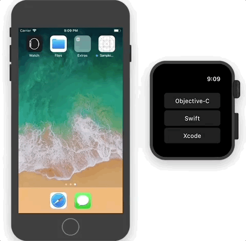

[](https://travis-ci.org/abdullahselek/SwiftyMessenger)
[](http://cocoapods.org/pods/SwiftyMessenger)
[](https://github.com/Carthage/Carthage)


```
    _________ ___          ___  _   _____  _________ ___    ___
   /        / \  \        /  / |_| ( ___ \ \__   __/ \  \  /  /
  /   _____/   \  \  /\  /  /  | | | (  \/    ) (     \  \/  /
  \_____  \     \  \/  \/  /   | | | (_       | |      \    /
  /        \     \  ____  /    | | |  _)      | |       )  (
 /_______ /       \/    \/     |_| | (        | |       |  |
        \/                         | )        )_(       |__|
                                   |/
      _____        ______    ________  ________  ______   __      __     _____      ______  _________
     /     \      (  ____\  /       / /       / (  ____\ |  \    |  |   /     \    (  ____\ \______  \
    /       \     | (      /   ____/ /   ____/  | (      |  |\   |  |  /   ____\   | (       |        \
   /  /\ /\  \    | (__    \_____ \  \_____ \   | (__    |  | \  |  | /   /__/  |  | (__     |    |____\
  /  /  Y  \  \   |  __)   /       \ /       \  |  __)   |  |  \ |  | \______   /  |  __)    |     \\
 /  /       \  \  | (     /_______/ /_______/   | (      |  |   \|  |  _____/  /   | (       |    | \\
 |_/         |__| | (___/\      \/        \/    | (___/\ |__|    |__| |_______/    | (___/\  |____| |_|
                  (______/                      (______/                           (______/
```

# SwiftyMessenger

Swift toolkit for passing messages between iOS apps and extensions. It creates a bridge between container app and iOS extensions. SwiftyMessenger archives messages in files which are written to the application's shared App Group. SwiftyMessenger resembles interprocess communication between the app and the extension without a interprocess communication.

It also supports CFNotificationCenter Darwin Notifications in an effort to support realtime change notifications. When a message passed, interested parties can listen and can be notified (almost instant) of these changes on both side.

<p align="center">
	
</p>

## Requirements

| SwiftyMessenger Version | Minimum iOS Target | Minimum watchOS Target | Swift Version |
|:--------------------:|:---------------------------:|:---------------------------:|:--------------------:|
| 0.1 | iOS 9 | watchOS 2.0 | Swift 4.1 |

### NOTE

SwiftyMessenger can only work with App Group identifiers and Entitlements.

## CocoaPods

CocoaPods is a dependency manager for Cocoa projects. You can install it with the following command:
```
$ gem install cocoapods
```

To integrate SwiftyMessenger into your Xcode project using CocoaPods, specify it in your Podfile:
```
source 'https://github.com/CocoaPods/Specs.git'
platform :ios, '9.0'
use_frameworks!

target '<Your Target Name>' do
	pod 'SwiftyMessenger', '~>0.1'
end
```

## Carthage

Carthage is a decentralized dependency manager that builds your dependencies and provides you with binary frameworks.

You can install Carthage with Homebrew using the following command:

```
brew update
brew install carthage
```

To integrate SwiftyMessenger into your Xcode project using Carthage, specify it in your Cartfile:

```
github "abdullahselek/SwiftyMessenger" ~> 0.1
```

## Usage

**Initialization**

```
messenger = Messenger(withApplicationGroupIdentifier: "group.com.abdullahselek.swiftymessenger", directory: "messenger")
```

**Passing message**

```
messenger.passMessage(message: ["selectedCell": title], identifier: "selection")
```

**Reading message**

```
if let message = messenger.messageForIdentifier(identifier: "button") as? [String: Any] {
	let buttonTitle = message["buttonTitle"] as? String
}
```

**Listen message changes with identifier**

```
messenger.listenForMessage(withIdentifier: "button") { message in
    guard let message = message as? [String: Any] else {
        return
    }
    let buttonTitle = message["buttonTitle"] as? String
}
```

## Support for WatchConnectivity

SwiftyMessenger suports **WatchConnectivity** provided by Apple on **watchOS** extensions.

Here are two little notes you need to know if you want to use WatchConnectivity support in your app:

- `MessengerSession` is a singleton subclass that supports listening for WatchConnectivity messages. It can be used to listen `Messenger` messages you expect to receive from the WatchConnectivity framework. Be sure to activate the session once your listeners are set so that you can begin receiving message notifications.

- You can use `MessengerSessionContextTransiting` when creating your messenger, but it can easily overload the pipeline by sending too many messages at once.

## Transiting Types

You can find 5 available types under **TransitingType**.

- `file` (Message transiting by archiving and unarchiving messages that are written and read to files)
- `coordinatedFile` (Uses FileCoordinator)
- `sessionContext` (Support for the WatchConnectivity framework's Application Context)
- `sessionMessage` (Support for the WatchConnectivity framework's real time message passing ability)
- `sessionFile` (Support for the WatchConnectivity framework's file transfer ability)

## License

SwiftyMessenger is released under the MIT license. See LICENSE for details.

## Credits

Inspired by MutualMobile. Improved and all coded in new programming language Swift.
